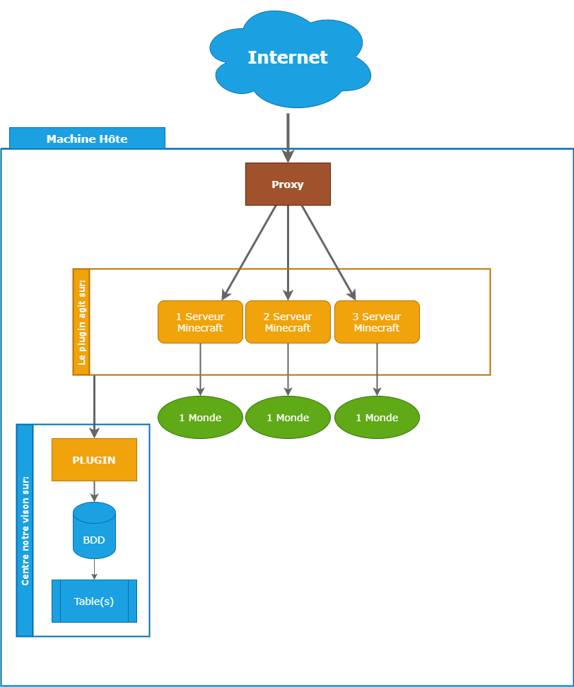
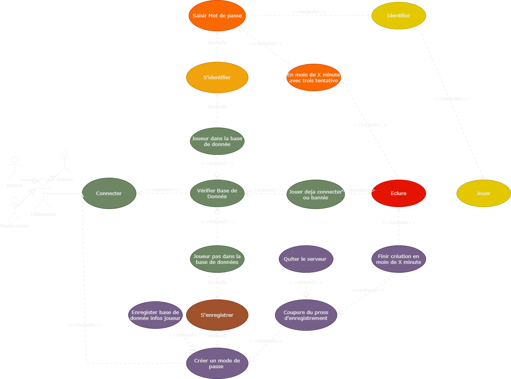
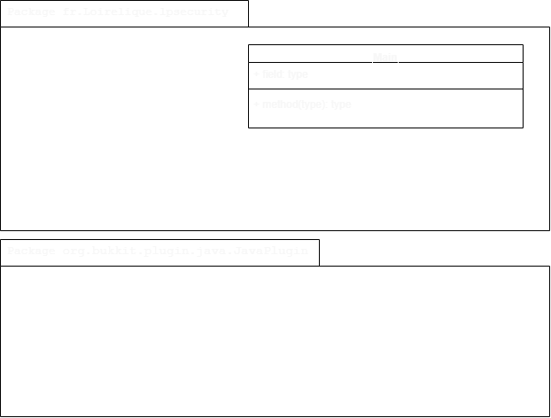

# LPsecurity 
Réalisaion d'un **plugin de sécurité** pour **Minecraft** sous version 1.8.8 avec un Proxy et base de données.

# Infrastructure d'une machine hôte.

**La machine hote** execute les différents processus. 
- Nous avons en exemple trois **serveur Minecraft** (ou plus) relier à un serveur **proxy** qui gère la connection entre les différents serveur Minecraft et  un serveur **mysql**.
- Afin de **sécurisé les connections des joueurs** nous avons besoin d'un **plugin**. Ceci évitera les voles de compte permetra une gestion de ses utilisateur grace à une base de données le tout sur la même machine.

# LPsecurity ?

**Le plugin** a pour bute de **sécurisé** un serveur Minecraft en version 1.8.8 relier à un proxy en **récupérent** les données joueurs et les **enregistrer** dans une base de donnée et incorpore .
> Exemple proxy ([BungeeCord](https://www.spigotmc.org/wiki/bungeecord/))
, serveur Minecraft ([Spigot 1.8.8](https://www.spigotmc.org))

 

# Diagramme de cas d'utilisation

1. Lors de la connection au serveur pour la premiere fois le joueur est invité à enregister un mot de passe pour pouvoir avoir acces au serveur il a alors X minute pour renseigner sont mot de passe au bout de ce temps impartie il est exclu.

- Si celui ci ne renseigne pas de mot de passe pour une premiere connection ses données joueur ne sont pas inscrite dans la base de données donc à la prochaine reconnection on demande un enregistrement.

- Si celui ci renseigne un mot de passe les données joueurs peuvent etre enregistrer dans la base de données.
	- Données enregistrer : 
		-  	Jouer-mot-de-passe ("Son mot de passe hash par algorithme sha256").
	- Données ajouter par default :
		- 	Joueur-ban (0/1) .
		- 	Joueur-online (0/1) . 
	- Données enregistrer automatique en fonction du joueur:
		-	Joueur-pseudo ("Son peseudo").
		-   Joueur-uuid ("Son uudi").
		- 	Jouer-adresse-IP ("Son IP).

2. Lors d'une connection avec connaissance du joueur dans la base de données.

- Le joueur devras renseigner sont mot de passe dans le X minutes suivant la connection sinon celui ci sera exclu:
	- Si celui ci ne coresspond pas le joueur est invité à retaper sont mot de passe il a alors trois tentative si celui ci echou il sera déconnecter du serveur.

3. Lors d'une connection au serveur avec le même pseudo qu'un autre joueur à des fin d'usurpé son identité.

	- Si un joueur essaye de ce connecter à un serveur en prenent l'identité de celui alors il est automatiquement exclue si le joueur et en ligne.

<!-- 
 -->

