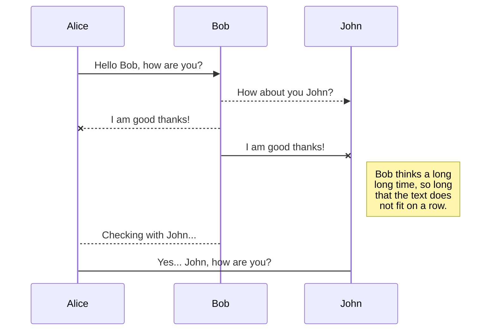
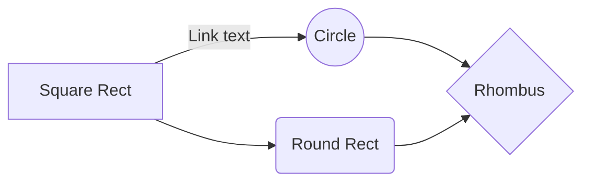

# LPsecurity 
Réalisaion d'un plugin de sécurité pour Minecraft sous version 1.8.8 avec un Proxy.

# Infrastructure d'une machine hôte.

# LPsecurity ?

Le **plugin** a pour bute de sécurisé un **serveur Minecraft** en version 1.8.8 relier à un **proxy** en récupérent les données joueurs et les enregistrer dans une **base de donnée**.
> Exemple proxy ([BungeeCord](https://www.spigotmc.org/wiki/bungeecord/))
, serveur Minecraft ([Spigot 1.8.8](https://www.spigotmc.org))

 

# Diagramme de cas d'utilisation

1. Lors de la connection au serveur pour la premiere fois le joueur est invité à enregister un mot de passe pour pouvoir avoir acces au serveur il a alors 5 minute pour renseigner sont mot de passe au bout de ce temps impartie il est exclu.

- Si celui ci ne renseigne pas de mot de passe pour une premiere connection ses données joueur ne sont pas inscrite dans la base de données donc à la prochaine reconnection on demande un enregistrement.

- Si celui ci renseigne un mot de passe les données joueurs peuvent etre enregistrer dans la base de données.
	- Données enregistrer : 
		-  	Jouer-mot-de-passe ("Son mot de passe hash par algorithme sha256").
	- Données ajouter par default :
		- 	Joueur-ban ("False") .
		- 	Joueur-warn (0) . 
	- Données enregistrer automatique en fonction du joueur:
		-	Joueur-pseudo ("Son peseudo").
		-   Joueur-uuid ("Son uudi").
		- 	Jouer-adresse-IP ("Son IP).

2. Lors d'une connection avec connaissance du joueur dans la base de données.

- Le joueur devras renseigner sont mot de passe dans le 2 minutes suivant la connection sinon celui ci sera exclu:
	- Si celui ci ne coresspond pas le joueur est invité à retaper sont mot de passe il a alors trois tentative si celui ci echou il sera déconnecter du serveur.

3. Lors d'une connection au serveur avec le même pseudo qu'un autre joueur à des fin d'usurpé son identité.

	- Si un joueur essaye de ce connecter à un serveur en prenent l'identité de celui alors il est automatiquement exclue.

- Données par default ajouter:
	- 	Joueur-ban ("False") + temps si == 0 Banissement indéfinie.
	- 	Joueur-warn (0) si warn incrémentation +1 et si warn == 3 ban == true et warn remit à 0. 
## SmartyPants

SmartyPants converts ASCII punctuation characters into "smart" typographic punctuation HTML entities. For example:

|                |ASCII                          |HTML                         |
|----------------|-------------------------------|-----------------------------|
|Single backticks|`'Isn't this fun?'`            |'Isn't this fun?'            |
|Quotes          |`"Isn't this fun?"`            |"Isn't this fun?"            |
|Dashes          |`-- is en-dash, --- is em-dash`|-- is en-dash, --- is em-dash|

## KaTeX

You can render LaTeX mathematical expressions using [KaTeX](https://khan.github.io/KaTeX/):

The *Gamma function* satisfying $\Gamma(n) = (n-1)!\quad\forall n\in\mathbb N$ is via the Euler integral

$$
\Gamma(z) = \int_0^\infty t^{z-1}e^{-t}dt\,.
$$

> You can find more information about **LaTeX** mathematical expressions [here](http://meta.math.stackexchange.com/questions/5020/mathjax-basic-tutorial-and-quick-reference).

## UML diagrams

You can render UML diagrams using [Mermaid](https://mermaidjs.github.io/). For example, this will produce a sequence diagram:

And this will produce a flow chart:

